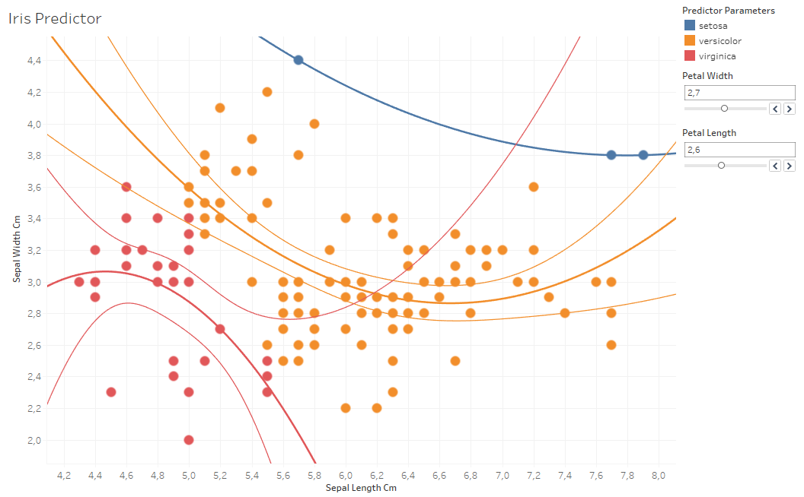
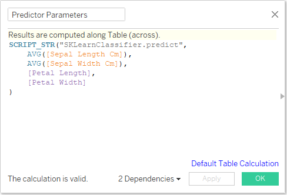

# Jupytab

[](https://circleci.com/gh/CFMTech/Jupytab)
&nbsp;[](https://badge.fury.io/py/jupytab)
&nbsp;[](https://opensource.org/licenses/MIT)

Jupytab allows you to **explore in [Tableau](https://www.tableau.com/) data which is generated dynamically by a Jupyter Notebook**. You can thus create Tableau data sources in a very flexible way using all the power of Python. This is achieved by having Tableau access data through a **web server created by Jupytab**.

**New** : Jupytab 0.9.7 now implements the [TabPy](https://github.com/tableau/TabPy) protocol, you can create your datasource and compute data on the fly from your notebook functions !

Jupytab is built on **solid foundations**: Tableau's [Web Data Connector](https://tableau.github.io/webdataconnector/) and the [Jupyter Kernel Gateway](https://github.com/jupyter/kernel_gateway).


## Overview

Features:

* **Expose multiple pandas dataframes** to Tableau from a Jupyter notebook
* Access **several notebooks** from Tableau through a **single entry point** (web server)
* Manage your notebooks using a **web interface**
* **Secure access** to your data
* **Compute data on the fly** using the [TabPy](https://github.com/tableau/TabPy) protocol

## Examples

You can find the example Jupyter notebooks and Tableau workbooks below are available in the [samples](samples) folder of
the Jupytab project.

### Preparation

If you want to run the example notebooks, it is necessary to define the Jupyter kernel that they run with:
```
python -m ipykernel install --user --name jupytab-demo
```
You can then launch the Jupytab server as instructed below.

### Air Flights

The first example illustrates how Jupytab allows you to **directly display realtime data** in Tableau (without going through the hassle of creating intermediate files or database tables). 
We will display the position and altitude of all planes from the freely available [OpenSky](https://opensky-network.org/) service. (_This service does not show planes currently flying over the 
ocean or uninhabited area!_)

The [AirFlights notebook](jupytab-server/samples/air-flights/AirFlights.ipynb) uses the [Requests](https://2.python-requests.org/en/master/) library to **access the OpenSky HTTP Rest API** and then exposes multiple metrics in a dataframe.
The provided [Tableau workbook](jupytab-server/samples/air-flights/AirFlights.twbx) gives the result below:


### Real Estate Price, and Crime 

The second example illustrates how simple it is to use Jupytab and **create a custom data source from multiple CSV files**. This is particularly convenient, because there is **no need to configure a new storage area** for these files in Tableau: the data is accessed through Jupytab's web service.

The [example notebook](jupytab-server/samples/real-estate_crime/RealEstateCrime.ipynb) exposes real estate and crime data for Sacramento, with a bit of [Pandas](http://pandas.pydata.org/) magic to combine several data sources. 

Thanks to the combination of data in a single dataframe, the [Tableau workbook](jupytab-server/samples/air-flights/AirFlights.twbx) can automatically show **maps over the same area of the city**:


### SkLearn Iris Predictor

The third example illustrate how you can use Jupytab to create your datasource and interact in real-time with your datas. This an ideal companion for your machine learning projects, as it allows you to keep all your python code in the notebook while offering the ability for Tableau users to freely interact with your datas and understand the impact of parameters change.

The [Iris Predictor notebook](jupytab-server/samples/sklearn-classifier/sklearn-classifier.ipynb) shows how you can combine data and code to create a all-in-one Tableau data source.



The python code is now only in your notebook ! The Tableau calculation is straightforward and do not rely on Python code.



# Installation

## Requirements

Python 3.6+ is currently required to run the Jupytab server.

The notebook code itself requires Python 3.6+ too (but it shouldn't be difficult to adapt Jupytab for Python 2).

Jupytab server relies on the official [Jupyter Kernel Gateway](https://github.com/jupyter/kernel_gateway).

## Automatic installation

The Jupytab server and its notebook library must both be installed. 

Jupytab server and its dependencies can easily be installed through pip:

```
pip install jupytab-server
```

For notebook kernels, you must install the jupytab library that only have a dependency on Pandas.

```
pip install jupytab
```

# Usage 

## Configuration file

You need to create a `config.ini` file in order to tell Jupytab which notebooks contain the tables that should be published for Tableau (this configuration file can be stored anywhere you choose). Here is an example of a working configuration file:

```
[main]
listen_port = 8765
security_token = myToken
notebooks = AirFlights|RealEstateCrime
ssl_enabled = True
ssl_key = /etc/pki/tls/certs/file.crt
ssl_cert = /etc/pki/tls/private/file.key

[AirFlights]
name = Air Flights
directory = samples/air-flights
path = ./AirFlights.ipynb
description = Realtime Flights Visualisation (API)

[RealEstateCrime]
name = RealEstateCrime
directory = samples/real-estate_crime
path = ./RealEstateCrime.ipynb
description = Real Estate Crime (static CSV)
```

There is only one mandatory section, `main`, which contains:

* `listen_port` (mandatory): Numeric port number (it must be available).
* `notebooks` (mandatory): List of notebooks to be executed by Jupytab, provided as a section name in the config file
and separated by the `|` (pipe) symbol. This must be a simple name compliant with [configparser](https://docs.python.org/3/library/configparser.html) sections.
* `security_token` (optional): If provided, an encrypted security token will be required for all exchanges with
Jupytab.
* `ssl_enabled` (optional): Enable or disable SSL
* `ssl_key` (mandatory if ssl_enabled is true): The path name of the server private key file
* `ssl_cert` (mandatory if ssl_enabled is true): The path name of the server public key certificate file
 
Additional sections contain information about each notebook to be run:

* `name` (optional): If provided, replaces the section name by a more friendly notebook name in the Jupytab web interface.
* `directory` (optional): If provided, the notebook will start with `directory` as its working directory instead of the one where the `jupytab` commands is launched (see below).
* `path` (mandatory): Relative (compared to `directory`) or absolute path to your notebook.
* `description` (optional): If provided, adds a description to your notebook in the Jupytab web interface.

Please make sure that the notebook name in the main section is exactly the same as in the section title!


## Notebook preparation

Publishing dataframes from a notebook is simple. Let's start by importing the necessary module:

```python
import pandas as pd

import jupytab
```

### Tables definition

The publication of data sources for Tableau from a notebook is done through two classes:

* Tables: Contains the publication-ready tables provided by the notebook. There is typically a single instance of this class in a given notebook.
* DataFrameTable: Table for either static or dynamic publication in Tableau. Static tables never change on the Tableau side. Dynamic tables are regenerated for each Tableau Extract.

```python
def dynamic_df():
    return pd.DataFrame([[1, 2, 3], [4, 5, 6], [7, 8, 9]], columns=['a', 'b', 'c'])

tables = jupytab.Tables()  # Publication-ready tables contained by this notebook

# Example 1: Static data: it will never change on the Tableau side:
static_df = dynamic_df()
tables['static'] = jupytab.DataFrameTable('A static table', dataframe=static_df)

# Example 2: Dynamic data: a new DataFrame is generated whenever Extract is requested on Tableau's side:
tables['dynamic'] = jupytab.DataFrameTable('A dynamic table', refresh_method=dynamic_df)
```

The tables listed in the Python variables `tables` now need to be explicitly marked for publication by Jupytab (both their schema and their contents). This is typically done at the very end of the notebook, with two special cells.

Please note that you can also include the index in the dataframe output using `include_index=True`. Index is not included by default.

```
# Example 3: Static data with index included
static_df = dynamic_df()
tables['static'] = jupytab.DataFrameTable('A static table', dataframe=static_df, include_index=True)
```

### Functions definition

Following the same principle, you can also expose your own python functions to Tableau through two classes:

```python
def multiply(my_first_number, my_second_number):
    return my_first_number * my_second_number
    
functions = jupytab.Functions() # Publication-ready functions contained by this notebook

functions['multiplier'] = jupytab.Function('A multiplier function with two parameters', multiply)
```

### Expose tables schema

When Tableau needs to retrieve the schema of all available tables, Jupytab executes the (mandatory) cell that starts with `# GET /schema`:

```python
# GET /schema
tables.render_schema()
```

(`tables.render_schema()` will output a JSON string when executed in the notebook.)

### Expose tables data

When Tableau needs to retrieve the data from tables, Jupytab executes the (mandatory) cell that starts with `# GET /data`:

```python
# GET /data
tables.render_data(REQUEST)
```

(Note that `tables.render_data(REQUEST)` will throw, as expected, `NameError: name 'REQUEST' is not defined` when executed in the notebook: `REQUEST` will only be defined when running with Jupytab, so the error is harmless.)

### Expose functions data

When Tableau needs to execute function, Jupytab executes the (mandatory) cell that starts with `# POST /evaluate`:

```python
# POST /evaluate
functions.render_evaluate(REQUEST)
```

(Note that `functions.render_evaluate(REQUEST)` will throw, as expected, `NameError: name 'REQUEST' is not defined` when executed in the notebook: `REQUEST` will only be defined when running with Jupytab, so the error is harmless.)

## Launching the Jupytab server

Once you have created your notebooks, it should be a matter of second before they become acessible from Tableau.
To start Jupytab, simply run the following command:
```
jupytab --config=config.ini
```
You should see the following ouput, which contains two important pieces of information:

* The list of published notebooks.
* The URL to be used in Tableau in order to access the data (including any security token declared in the configuration file).

```
(install-jupytab) user@localhost:~$ jupytab --config=tests/config.ini
Start notebook ~/tests/resources/rt_flights.ipynb on 127.0.0.1:57149
Start notebook ~/tests/resources/csv_reader.ipynb on 127.0.0.1:53351
Your token is 02014868fe0eef123269397c5bc65a9608b3cedb73e3b84d8d02c220
        Please open : http://localhost:8765/?security_token=02014868fe0eef123269397c5bc65a9608b3cedb73e3b84d8d02c220
INFO:[KernelGatewayApp] Kernel started: 1befe373-aebd-4b31-9f98-2f90f235f255
INFO:[KernelGatewayApp] Kernel started: 365bfdb6-887b-41b4-ad69-309a200f5137
INFO:[KernelGatewayApp] Registering resource: /schema, methods: (['GET'])
INFO:[KernelGatewayApp] Registering resource: /data, methods: (['GET'])
INFO:[KernelGatewayApp] Registering resource: /_api/spec/swagger.json, methods: (GET)
INFO:[KernelGatewayApp] Jupyter Kernel Gateway at http://127.0.0.1:53351
INFO:[KernelGatewayApp] Registering resource: /schema, methods: (['GET'])
INFO:[KernelGatewayApp] Registering resource: /data, methods: (['GET'])
INFO:[KernelGatewayApp] Registering resource: /_api/spec/swagger.json, methods: (GET)
INFO:[KernelGatewayApp] Jupyter Kernel Gateway at http://127.0.0.1:57149
```

## Connect Tableau to your notebooks

### Web Data Connector for data sources

Connecting Tableau to your notebooks is simply done by copying the URL provided by Jupytab upon startup to the Tableau Web Data Connector:


You can now use the Tableau Web Data Connector screen and access your data sources through the Jupytab interface.

### TabPy Connector to execute functions

Connecting Tableau to your notebooks to execute code on the fly using the [External Connection Service](https://help.tableau.com/current/pro/desktop/en-us/r_connection_manage.htm).

The address to use is the host where Jupytab is running. The port is the one you configured in the `config.ini` file.

Please take care to select the **TabPy / External API** and not RServe.

## Troubleshooting

If you encounter a any problem when using Jupytab, you can find it useful to check the console where you launched 
Jupytab for diagnostic messages. The console output can in particular be usefully included when you raise a GitHub issue.

# Contact and contributing

Contributions are very welcome.  It can be

- a new GitHub issue,
- a feature request,
- code (see the [Developement Guide](jupytab-server/docs/source/development-guide.md)),
- or simply feedback on this project.

The main author of Jupytab is Brian Tribondeau, who can be reached at brian.tribondeau@cfm.fr.

